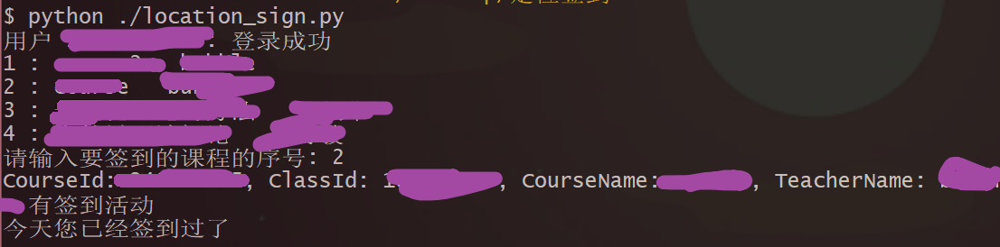

# chaoxingLocationSign
这是用于针对超星学习通定位签到的一套python代码，参考原作者仓库地址[https://github.com/cxOrz/chaoxing-sign-cli], 仅限于用于学习网络请求的接收和发送。

# 1.项目简介

主要用于<u>超星学习通</u>**定位签到**的python代码

# 2.项目下载

在使用代码之前，请确保已经下载并安装了**python解释器**，并且可以通过**pip**进行包的安装，详细细节请上网自行搜索。

同时，请确保已经安装了以下的python包，如果没有，可执行下列命令进行安装

```
pip install requests pycryptodome
```

## 2.1.使用git进行下载

打开终端执行下列命令将代码拷贝到本地

```
git clone https://github.com/alextomdog/chaoxingLocationSign.git
```

进入项目目录

```
cd ./chaoxingLocationSign
```

## 2.2.通用方式下载

通过点击左上角的`code`下载其压缩包，然后进行解压

# 3.使用方式

## 3.1.配置

在`location_sign.py`中修改下列参数进行配置

> 用户登录配置

```
username = "18888888888"  # 手机号
password = "**********"  # 密码
```

> 坐标地理位置配置

请使用坐标拾取器获得地理位置的经度纬度，当前使用的是<u>百度坐标拾取器</u>，如下：

https://api.map.baidu.com/lbsapi/getpoint/

将下列内容替换为自己拾取的坐标的地址

```
location_geography = '104.19107,30.827562'
```

> 定位地址名配置

请在学习通中找到已经进行过定位签到的`签到`, 然后查看这个签到的详细信息，其中包含**地址名称信息**，请复制这个地址，然后对下列地址名称进行替换

*注意：签到地址名字是显示在教师端和学生端地址信息名字的一种标识*

```
address_name = "中国四川省成都市xxxxxx"
```

## 3.2.运行程序

进入到项目根目录，然后执行python脚本

```
python ./location_sign.py
```

将会弹出以下内容，然后按照内容提示输入签到的课程序号，将针对该课程进行定位签到




